```{r setup, include=FALSE}
knitr::opts_chunk$set(echo = TRUE)
```

# Background

This is the third assignment for the BCB420H1 course \@ U of T.
In this assignment, we will be performing non-thresholdeed GSEA on our ranked set of genes that we created in A2, and we will then visualize our GSEA using Cytoscape.

# Loading in Libraries

First, let's load in all of our libraries for the first part of our analysis.

```{r, include=FALSE}
if (! requireNamespace("GEOquery", quietly = TRUE)) {
  BiocManager::install("GEOquery")
}

if (!requireNamespace("edgeR", quietly = TRUE)) {
  install.packages("edgeR")
}

if (!requireNamespace("knitr", quietly = TRUE)) {
  install.packages("knitr")
}

if (!requireNamespace("HGNC", quietly = TRUE)) {
  install.packages("hgnc")
}

if (!requireNamespace("ggrepel", quietly = TRUE)) {
    install.packages("ggrepel")
}

if (!requireNamespace("gprofiler2", quietly = TRUE)) {
    install.packages("gprofiler2")
}

library(GEOquery)
library(edgeR)
library(knitr)
library(kableExtra)
library(httr)
library(data.table)
library(hgnc)
library(RColorBrewer)
library(ggplot2)
library(pheatmap)
library(dplyr)
library(ggrepel)
library(ComplexHeatmap)
library(circlize)
library(gprofiler2)
library(tidyr)
library(devtools)
library(BiocParallel)
install_github("ctlab/fgsea")
library(fgsea)
```

# Assignment 1+2 Recap

We are working with the [GSE205517](https://www.ncbi.nlm.nih.gov/geo/query/acc.cgi?acc=GSE205517) dataset.
This dataset and its accompanying study investigates the differentiation of hPSCs into left ventricular cardiomyocytes, and compares them to patient derived samples.
[@cm_data] The study compares the transcriptomes of both conditions in order to determine similarity for potential therapeutic purposes.
This study is a SuperSeries containing the SubSeries: - [GSE203375](https://www.ncbi.nlm.nih.gov/geo/query/acc.cgi?acc=GSE203375), containing the hPSCs - [GSE204885](https://www.ncbi.nlm.nih.gov/geo/query/acc.cgi?acc=GSE204885), containing the patient samples We will download both.
In the previous assignment, we performed normalization on the RNA-Seq data, along with remapping HGNC symbols to avoid collisions.
In this assignment, we will be perform differential gene expression (DGE) analysis, along with over-representation analysis (ORA).
Before we begin these new steps, we will run the data acquisition, data overview, and normalization steps, and overview stats from assignment 1.

For A2, we continued with the cleaned up data and found DGEs using edgeR. We performed BH corrections, and we also displayed volcano plots to point out key genes (not pictured here). We then used heatmaps to show clustering, and then conducted ORA using g:Profiler for up and downregulated pathways. In terms of our findings:

- Significant differential expression was observed particularly between the earliest and latest stages of differentiation, highlighting the dynamic changes in gene expression as stem cells mature into cardiomyocytes.
- Over-representation analysis revealed pathways consistent with cardiac muscle development and function, aligning with the expected outcomes of successful cardiomyocyte differentiation.
- Comparisons with patient samples indicated significant transcriptional differences, suggesting that while in vitro differentiated cells share many markers with in vivo heart cells, there are still considerable differences likely due to the microenvironment and physical conditions of the heart.

## Data Acquisition

First, let's perform our data acquisition step using GEOQuery. [@GEOquery]
We'll be re-using code blocks from A1.

```{r}
# GEO Accession numbers
geo_acc_1 <- "GSE203375"
geo_acc_2 <- "GSE204885"

# The filenames for saving/loading data
filename_1 <- paste0(geo_acc_1, ".RData")
filename_2 <- paste0(geo_acc_2, ".RData")

# Reading in files from the GEO or locally
if (!file.exists(filename_1)) {
  gset_1 <- getGEO(geo_acc_1, GSEMatrix=TRUE, getGPL=FALSE)
  saveRDS(gset_1, filename_1)
} else {
  gset_1 <- readRDS(filename_1)
}
gset_1 <- gset_1[[1]]

if (!file.exists(filename_2)) {
  gset_2 <- getGEO(geo_acc_2, GSEMatrix=TRUE, getGPL=FALSE)
  saveRDS(gset_2, filename_2)
} else {
  gset_2 <- readRDS(filename_2)
}
gset_2 <- gset_2[[1]]
```

We now have our data loaded in.
We now need to retrieve the counts tables from the GEO.

```{r}
# load counts table from GEO
urld <- "https://www.ncbi.nlm.nih.gov/geo/download/?format=file&type=rnaseq_counts"
path_1 <- paste(urld, paste0("acc=", geo_acc_1), paste0("file=", geo_acc_1, "_raw_counts_GRCh38.p13_NCBI.tsv.gz"), sep="&");
path_2 <- paste(urld, paste0("acc=", geo_acc_2), paste0("file=", geo_acc_2, "_raw_counts_GRCh38.p13_NCBI.tsv.gz"), sep="&");

# This checks if we already have the previous matrices saved in or not. If we have a local copy, we don't re-download. This is a time-saving and efficiency measure.
if (!file.exists(paste0(geo_acc_1,"_raw_counts.RData"))) {
  counts_data_1 <- as.matrix(data.table::fread(path_1, header=T, colClasses="integer"), rownames=1)
  name_mapping <- setNames(gset_1@phenoData@data[["title"]], gset_1@phenoData@data[["geo_accession"]])
  colnames(counts_data_1) <- name_mapping[colnames(counts_data_1)]
  saveRDS(counts_data_1, paste0(geo_acc_1, "_raw_counts.RData"))
} else {
  counts_data_1 <- readRDS(paste0(geo_acc_1, "_raw_counts.RData"))
}

# We do the same for our second dataset

if (!file.exists(paste0(geo_acc_2,"_raw_counts.RData"))) {
  counts_data_2 <- as.matrix(data.table::fread(path_2, header=T, colClasses="integer"), rownames=1)
  name_mapping <- setNames(gset_2@phenoData@data[["title"]], gset_2@phenoData@data[["geo_accession"]])
  colnames(counts_data_2) <- name_mapping[colnames(counts_data_2)]
  saveRDS(counts_data_2, paste0(geo_acc_2, "_raw_counts.RData"))
} else {
  counts_data_2 <- readRDS(paste0(geo_acc_2, "_raw_counts.RData"))
}
counts_data <- cbind(counts_data_1, counts_data_2)
```

## Briefly Explaining our Data

This excerpt is directly from A1: Some basic information about the dataset can be obtained through the ExpressionSet we've read in.
The study investigated differentiation of two different cell lines, H9 of karyotype 46, XX, and MLC2V of karyotype 46, XY, corresponding to cells originating from female and male sources, respectively.
It then compared to to patient samples harvested from left and right atrial and ventricular tissue, along with cardiomyocytes individually harvested from each section of the heart from three patients each.

Below are the experimental details provided in the gset objects for both series:

```{r}
gset_1@experimentData@title # study title
gset_1@experimentData@abstract # study abstract
gset_1@experimentData@other$overall_design # summary of experiment
unique(gset_1@phenoData@data[["extract_protocol_ch1.1"]]) # platform

unique(gset_1@phenoData@data[["experiment number:ch1"]]) # heart
unique(gset_1@phenoData@data[["cell_line:ch1"]]) # cell lines
unique(gset_1@phenoData@data[["day:ch1"]]) # day of differentiation

gset_1@experimentData@other$platform_id # GPL id
gset_1@experimentData@other$last_update_date # last update date
unique(gset_1@phenoData@data$organism_ch1) # organism
```

```{r}
gset_2@experimentData@title # study title
gset_2@experimentData@abstract # study abstract
gset_2@experimentData@other$overall_design # summary of experiment
unique(gset_2@phenoData@data[["extract_protocol_ch1.1"]]) # platform

unique(gset_2@phenoData@data[["chamber:ch1"]]) # cell lines
unique(gset_2@phenoData@data[["patient:ch1"]]) # patient
unique(gset_2@phenoData@data[["tissue:ch1"]]) # tissue

gset_2@experimentData@other$platform_id # GPL id
gset_2@experimentData@other$last_update_date # last update date
unique(gset_2@phenoData@data$organism_ch1) # organism
```

```{r}
sample_info_1 <- gset_1@phenoData@data[ , (ncol(gset_1@phenoData@data)-2):ncol(gset_1@phenoData@data)]
colnames(sample_info_1) <- gsub(":ch1", "", colnames(sample_info_1)) 
knitr::kable(sample_info_1, format = "pipe", caption = "<b>Table 1:</b> Sample information for Cardiomyocytes Derived from Stem Cells")
```

```{r}
sample_info_2 <- gset_2@phenoData@data[ , (ncol(gset_2@phenoData@data)-2):ncol(gset_2@phenoData@data)]
colnames(sample_info_2) <- gsub(":ch1", "", colnames(sample_info_2)) 
knitr::kable(sample_info_2, format = "pipe", caption = "<b>Table 2:</b> Sample information for Patient-Derived Samples")
```

## Data-Cleaning

To clean our data, we will do two things: 1.
Filter out zero-expressors 2.
Perform HGNC re-mapping 3.
Normalize the data

### Filtering Out Zero-Expressors

From A1, we know that there are genes that minimally express throughout different conditions, and as a result, we will be filtering those out.

```{r}
# Pick out all rows that have zeroes across all conditions
rows_to_keep <- apply(counts_data, 1, function(row) any(row != 0))

# Create new matrix containing only the rows that aren't all zeroes
counts_data_zero_filtered <- counts_data[rows_to_keep, ]
```

### Data Normalization

In line with the experimenters' analyses, we will normalize the data together

First, let's perform CPM filtering to remove low expressors.

```{r}
# Minimum number of samples for the hPSC run
min_num_samples <- 2
counts_data_zero_filtered_matrix <- as.matrix(counts_data_zero_filtered)

# Get rid of low counts
# We add 0.1 for numerical stability and to prevent NA values when evaluating logs
keep = rowSums(log2(cpm(counts_data_zero_filtered_matrix+0.1)) > 1) > min_num_samples
filtered_counts_matrix = counts_data_zero_filtered_matrix[keep,]
```

After, we will use TMM from edgeR [@edgeR] to perform our normalization steps.

```{r}
# We will make our DGEList with the filtered count matrices
d <- DGEList(counts=filtered_counts_matrix)

# Calculate normalization factors
d <- calcNormFactors(d)

# Apply normalization
normalized_counts <- cpm(d)
```

Normalization is now done, and we can move onto HGNC mapping.

### HGNC Mapping

The protocol followed for HGNC mapping is nearly identical to the first assignment.
First, we will add a column to our normalized with the appropriate NCBI gene ID.
While we do have the annotation table, it is also true that we were specified to still manually perform this step.
We will download a copy of the HGNC dataset. [@HGNC]
The dataset is confirmed to be up-to-date with the date of download.

```{r}
# Download the HGNC file if it doesn't already exist in the cwd
if (!file.exists("hgnc_genes.RData")) {
  hgnc_genes <- import_hgnc_dataset(file=latest_archive_url())
  saveRDS(hgnc_genes, "hgnc_genes.RData")
} else {
  hgnc_genes <- readRDS("hgnc_genes.RData")
}
hgnc_mapping <- hgnc_genes[, c('symbol', 'entrez_id')]
```

Now that we have a mapping, we can apply this to the table.

```{r}
# Convert the normalized counts into a dataframe
normalized_counts_df <- as.data.frame(normalized_counts)

# Add rownames
normalized_counts_df$NCBI_gene_id <- rownames(normalized_counts_df)

# Map the entrez_id to the NCBI_gnes
labelled_counts_data <- merge(normalized_counts_df, hgnc_mapping, by.x = "NCBI_gene_id", by.y = 'entrez_id', all.x = TRUE)
labelled_counts_data <- labelled_counts_data[,c(1, ncol(labelled_counts_data), 3:ncol(labelled_counts_data)-1)]

knitr::kable(labelled_counts_data[c(1:10), c(1,2)], format = "pipe", caption = "<b>Table 3:</b> Table Matching First 10 NCBI Gene IDs to the Approved HGNC Symbols")

labelled_counts_data <- labelled_counts_data[, -c(1)]
```

Now, we must deal with `NA` and empty values, along with many-to-one mappings.

```{r}
# Remove all NA labels
no_na_labelled_counts_data <- labelled_counts_data[!is.na(labelled_counts_data$symbol), ]

# Remove all empty strings symbols
no_emp_labelled_counts_data <- no_na_labelled_counts_data[no_na_labelled_counts_data$symbol != '', ]

rownames(no_emp_labelled_counts_data) <- no_emp_labelled_counts_data[, 1]
final_normalized_data <- no_emp_labelled_counts_data[, -c(1)]
```

## Overview Statistics

Now that we have our data, we can look at a few counting statistics to gain insight into what we're looking at.

```{r}
# Create a list of overview stats
overview_stats <- list()

# Do it for each sample
for (sample_name in colnames(final_normalized_data)) {
  sample_data <- final_normalized_data[, sample_name]
  
  total_counts <- sum(sample_data)
  mean_counts <- mean(sample_data)
  median_counts <- median(sample_data)
  sd_counts <- sd(sample_data)
  var_counts <- var(sample_data)
  overview_stats[[sample_name]] <- c(total_counts, mean_counts, median_counts, sd_counts, var_counts)
}

overview_stats_df <- do.call(rbind, overview_stats)
rownames(overview_stats_df) <- names(overview_stats)
colnames(overview_stats_df) <- c("Total Counts", "Mean Counts", "Median Counts", "Counts Standard Deviation", "Counts Variation")

knitr::kable(overview_stats_df[, ], format = "pipe", caption = "<b>Table 4:</b> Overview Statistics of Normalized Samples. The total counts are somewhat similar, but the mean counts are lower in the hPSC-derived samples. Mean counts are somewhat similar in both, but the median counts are greater in the hPSCs. The standard deviation and variation in the hPSCs is far lesser than that of the patient samples.")
```

We can see that there is strong clustering of all the patient-derived samples, and there's also temporal clustering of all the stem cell-derived CMs.
This is evidenced by the fact the from left to right, we see a 'continuous' clustering of cardiomyocytes from d60 to d0.
We see that the patient samples all cluster together quite strongly, but further away in the firsta and second dimensions. This can likely be explained due to higher variance and low median counts in the patient data, but the fact that the cells came from warm cadavers, and the cell niche
The range for the MDS Leading logFC dimensions are also quite high, which could be explained due to having two different types of data here.

# Differential Gene Expression

We will now prefer differential gene expression analyses.
Based on the results of the previously generated MDS plots, I think that important analyses would be:
* Pairwise comparisons between each time point of the hPSC to cardiomyocyte differentiation
    + Specifically a comparison between day 0 and day 60 of the stem cell experiments - Comparison of the day 60
* hPSC-cardiomyocyte to the rest of the patient heart cells

## Determining p-Values

We will determine the p-values of each of the experiment using edgeR. [@edgeR]

```{r}
# 1. Prepare the data

# Truncate the sample names
converted_names <- gsub("Heart \\d+ Day (\\d+) .*", "day \\1", colnames(final_normalized_data))
converted_names <- gsub("Patient \\d+ (Left|Right) (Ventricle|Atria) .*", "\\1 \\2", converted_names)
converted_names <- gsub(" ", "", converted_names)
```

```{r}
# Create a data frame with sample information
samples <- data.frame(converted_names)

# Convert the count data to a DGEList object
dge <- DGEList(counts = final_normalized_data)

# 2. Create the design matrix
# Create the design matrix with only 'day' as a factor
design <- model.matrix(~0 + factor(samples$converted_names))

# Rename the columns to be more interpretable
colnames(design) <- gsub("factor\\(samples\\$converted_names\\)", "", colnames(design))

dge <- estimateDisp(dge, design)

# 4. Fit the model
fit <- glmQLFit(dge, design)
```

Now, we will create the contrast matrices for comparisons.

```{r}
# 5. Create contrast matrices
twoVS0con <- makeContrasts(
    day2vsday0 = day2 - day0,
    levels = design
)
fourVS2con <- makeContrasts(
    day4vsday2 = day4 - day2,
    levels = design
)
sixVS4con <- makeContrasts(
    day6vsday4 = day6 - day4,
    levels = design
)
tenVS6con <- makeContrasts(
    day10vsday6 = day10 - day6,
    levels = design
)
fifteenVS10con <- makeContrasts(
    day15vsday10 = day15 - day10,
    levels = design
)
twentyVS15con <- makeContrasts(
    day20vsday15 = day20 - day15,
    levels = design
)
fortyVS20con <- makeContrasts(
    day40vsday20 = day40 - day20,
    levels = design
)
sixtyVS40con <- makeContrasts(
    day60vsday40 = day60 - day40,
    levels = design
)
sixtyVS0con <- makeContrasts(
    day60vsday0 = day60 - day0,
    levels = design
)
lvVS60 <- makeContrasts(
    LVvsday0 = LeftVentricle - day60,
    levels = design
)
rvVS60 <- makeContrasts(
    RVvsday60 = RightVentricle - day60,
    levels = design
)
laVS60 <- makeContrasts(
    LAvsday60 = LeftAtria - day60,
    levels = design
)
raVS60 <- makeContrasts(
    RAvsday60 = RightAtria - day60,
    levels = design
)
lvVSrv <- makeContrasts(
    lvvsrv = LeftVentricle - RightVentricle,
    levels = design
)
```

Now, we can find differential expression between conditions

```{r}
# 6. Perform the tests
twoVS0_lrt <- glmQLFTest(fit, contrast = twoVS0con)
fourVS2_lrt <- glmQLFTest(fit, contrast = fourVS2con)
sixVS4_lrt <- glmQLFTest(fit, contrast = sixVS4con)
tenVS6_lrt <- glmQLFTest(fit, contrast = tenVS6con)
fifteenVS10_lrt <- glmQLFTest(fit, contrast = fifteenVS10con)
twentyVS15_lrt <- glmQLFTest(fit, contrast = twentyVS15con)
fortyVS20_lrt <- glmQLFTest(fit, contrast = fortyVS20con)
sixtyVS40_lrt <- glmQLFTest(fit, contrast = sixtyVS40con)
sixtyVS0_lrt <- glmQLFTest(fit, contrast = sixtyVS0con)
lvVS60_lrt <- glmQLFTest(fit, contrast = lvVS60)
rvVS60_lrt <- glmQLFTest(fit, contrast = rvVS60)
laVS60_lrt <- glmQLFTest(fit, contrast = laVS60)
raVS60_lrt <- glmQLFTest(fit, contrast = raVS60)
lvVSrv_lrt <- glmQLFTest(fit, contrast = lvVSrv)

# 7. Extract results
results_twoVS0 <- topTags(twoVS0_lrt, sort.by = "PValue", n = nrow(final_normalized_data), adjust.method = "BH")
results_fourVS2 <- topTags(fourVS2_lrt, sort.by = "PValue", n = nrow(final_normalized_data), adjust.method = "BH")
results_sixVS4 <- topTags(sixVS4_lrt, sort.by = "PValue", n = nrow(final_normalized_data), adjust.method = "BH")
results_tenVS6 <- topTags(tenVS6_lrt, sort.by = "PValue", n = nrow(final_normalized_data), adjust.method = "BH")
results_fifteenVS10 <- topTags(fifteenVS10_lrt, sort.by = "PValue", n = nrow(final_normalized_data), adjust.method = "BH")
results_twentyVS15 <- topTags(twentyVS15_lrt, sort.by = "PValue", n = nrow(final_normalized_data), adjust.method = "BH")
results_fortyVS20 <- topTags(fortyVS20_lrt, sort.by = "PValue", n = nrow(final_normalized_data), adjust.method = "BH")
results_sixtyVS40 <- topTags(sixtyVS40_lrt, sort.by = "PValue", n = nrow(final_normalized_data), adjust.method = "BH")
results_sixtyVS0 <- topTags(sixtyVS0_lrt, sort.by = "PValue", n = nrow(final_normalized_data), adjust.method = "BH")
results_lvVS60 <- topTags(lvVS60_lrt, sort.by = "PValue", n = nrow(final_normalized_data), adjust.method = "BH")
results_rvVS60 <- topTags(rvVS60_lrt, sort.by = "PValue", n = nrow(final_normalized_data), adjust.method = "BH")
results_laVS60 <- topTags(laVS60_lrt, sort.by = "PValue", n = nrow(final_normalized_data), adjust.method = "BH")
results_raVS60 <- topTags(raVS60_lrt, sort.by = "PValue", n = nrow(final_normalized_data), adjust.method = "BH")
results_lvVSrv <- topTags(lvVSrv_lrt, sort.by = "PValue", n = nrow(final_normalized_data), adjust.method = "BH")
```

I chose to use a cut-off of 0.01, in-line with the original study, and the limit the amount of genes that show up as significant, as there is a lot of temporal variation in stem cell differentiation protocols. In terms of the multiple hypothesis correction, I chose to use Benjamini-Hochberg for its robustness and that it seems quite standard in such analyses.

We will now present summary data in a table for each comparison.

```{r}
summary_table <- data.frame(
  Comparison = c("Day 2 VS Day 0",
                 "Day 4 VS Day 2",
                 "Day 6 VS Day 4",
                 "Day 10 VS Day 6",
                 "Day 15 VS Day 10",
                 "Day 20 VS Day 15",
                 "Day 40 VS Day 20",
                 "Day 60 VS Day 40",
                 "Day 60 VS Day 0",
                 "LV VS Day 60",
                 "RV VS Day 60",
                 "LA VS Day 60",
                 "RA VS Day 60",
                 "LV VS RV"
                 ),
  Significant = c(length(which(results_twoVS0$table$PValue < 0.01)),
                  length(which(results_fourVS2$table$PValue < 0.01)),
                  length(which(results_sixVS4$table$PValue < 0.01)),
                  length(which(results_tenVS6$table$PValue < 0.01)),
                  length(which(results_fifteenVS10$table$Value < 0.01)),
                  length(which(results_twentyVS15$table$PValue < 0.01)),
                  length(which(results_fortyVS20$table$PValue < 0.01)),
                  length(which(results_sixtyVS40$table$PValue < 0.01)),
                  length(which(results_sixtyVS0$table$PValue < 0.01)),
                  length(which(results_lvVS60$table$PValue < 0.01)),
                  length(which(results_rvVS60$table$PValue < 0.01)),
                  length(which(results_laVS60$table$PValue < 0.01)),
                  length(which(results_raVS60$table$PValue < 0.01)),
                  length(which(results_lvVSrv$table$PValue < 0.01))
                  ),
  Corrected = c(length(which(results_twoVS0$table$FDR < 0.01)),
                length(which(results_fourVS2$table$FDR < 0.01)),
                length(which(results_sixVS4$table$FDR < 0.01)),
                length(which(results_tenVS6$table$FDR < 0.01)),
                length(which(results_fifteenVS10$table$FDR < 0.01)),
                length(which(results_twentyVS15$table$FDR < 0.01)),
                length(which(results_fortyVS20$table$FDR < 0.01)),
                length(which(results_sixtyVS40$table$FDR < 0.01)),
                length(which(results_sixtyVS0$table$FDR < 0.01)),
                length(which(results_lvVS60$table$FDR < 0.01)),
                length(which(results_rvVS60$table$FDR < 0.01)),
                length(which(results_laVS60$table$FDR < 0.01)),
                length(which(results_raVS60$table$FDR < 0.01)),
                length(which(results_lvVSrv$table$FDR < 0.01))
                )
)

kable(summary_table, caption = "Table 5: The number of genes that show the number of significantly differentially expressed genes before and after FDR correction. For the temporal analysis, the first two comparisons hover around 1800 genes, the next two are at around 900, and then there's a steep drop off at the day 15 vs 10 and day 20 vs 15 comparisons. This picks back up. This picks back up intil days 60 to 40, showing minimal change, suggesting that they're in late stage maturation. Between day 60 and patient samples, many genes, all above 6000, are significantly differentially expressed. Between ventricles, no change is observed. ")
```

As expected, the comparison with the greatest number of differentially expressed genes was between day 60 and day 0, which compares an hPSC to a left ventricular cardiomyocyte derived from stem cells.
Interestingly, we see a very small amount of differentially expressed genes for day 15 vs day 10 and day 60 and day 40.
In terms of the patient sample comparisons, we see that all of them have a great number of genes with a significant values of differential expression, which indicates that even the mature hPSC-derived CM is very far from the patient by transcriptome.
This could be explained due to the niche of the cell--cardiomyocytes in vivo are constantly beating, working to pump blood, and are also surrounded by other tissue types which secrete signals to regulate expression of different transcripts.
In a dish, this isn't the case, which could explain this phenomenon.
We can investigate this more closely once we see which genes come out as top hits.

We will save our results in a list for ease of downstream analysis.

```{r}
# List of all the results objects
results_list <- list(
  results_twoVS0 = results_twoVS0,
  results_fourVS2 = results_fourVS2,
  results_sixVS4 = results_sixVS4,
  results_tenVS6 = results_tenVS6,
  results_fifteenVS10 = results_fifteenVS10,
  results_twentyVS15 = results_twentyVS15,
  results_fortyVS20 = results_fortyVS20,
  results_sixtyVS40 = results_sixtyVS40,
  results_sixtyVS0 = results_sixtyVS0,
  results_lvVS60 = results_lvVS60,
  results_rvVS60 = results_rvVS60,
  results_laVS60 = results_laVS60,
  results_raVS60 = results_raVS60,
  results_lvVSrv = results_lvVSrv
)

# Titles for each plot
titles <- c(
  "Day 2 vs Day 0",
  "Day 4 vs Day 2",
  "Day 6 vs Day 4",
  "Day 10 vs Day 6",
  "Day 15 vs Day 10",
  "Day 20 vs Day 15",
  "Day 40 vs Day 20",
  "Day 60 vs Day 40",
  "Day 60 vs Day 0",
  "LV vs Day 60",
  "RV vs Day 60",
  "LA vs Day 60",
  "RA vs Day 60",
  "LV vs RV"
)
```

## Filtering for Top Hits

We will now filter with the same parameters used to filter in the volcano plots.

```{r}
# Filter each comparison based on the specified criteria
filtered_results_list <- lapply(results_list, function(result) {
  result$table %>%
    filter(FDR < 0.01, abs(logFC) > 2)
})

# Names for the filtered results
names(filtered_results_list) <- names(results_list)

filtered_results_display_df <- data.frame(
  Num_Genes = sapply(filtered_results_list, nrow)
)

kable(filtered_results_display_df, caption = "Table 6: Number of genes meeting criteria for each comparison. Notice that because of the logFC conition, all values are necessarily equal to or smaller than the values in Table 5.")
```

## Filtering for All and Unique Differentially Expressed Genes

```{r}
# Extract gene names from each filtered result and combine them into a single vector
union_gene_names <- unlist(lapply(filtered_results_list, function(filtered_result) {
  rownames(filtered_result)
}))

# Remove duplicate gene names
all_genes <- unique(union_gene_names)
```

We will also need single genes for downstream analysis.

```{r}
# Get only the unique genes for downstream analysis
gene_counts <- table(union_gene_names)
unique_genes <- names(gene_counts[gene_counts == 1])
```

# Over-Representation Analysis

## Defining Up and Down-Regulated Gene Sets

Here, we will define up and down-regulated gene sets.
The goal of this function block was to create a general overall list of genes that were up and down-regulated for each condition, and to create a pooled one as well.
In terms of significance values, we'll use a cut-off of FDR \< 0.05 and the magnitude of logFC being 0.
These are the same parameters the authors used in their analysis.

```{r}
ora_filtered_results_list <- lapply(results_list, function(result) {
  result$table %>%
    filter(FDR < 0.05)
})

up_regulated_results_list <- lapply(ora_filtered_results_list, function(result) {
  result %>%
    filter(logFC > 0)
})

up_regulated_results_list <- lapply(up_regulated_results_list, function(result) {
  rownames(result)
})

down_regulated_results_list <- lapply(ora_filtered_results_list, function(result) {
  result %>%
    filter(logFC < 0)
})

down_regulated_results_list <- lapply(down_regulated_results_list, function(result) {
  rownames(result)
})

all_up_regulated_genes <- unique(unlist(up_regulated_results_list))
all_down_regulated_genes <- unique(unlist(down_regulated_results_list))
```

## Setting up the g:Profiler

Let's set up the g:Profiler for all of the aforementioned combinations (per condition, for significant, up and down-regulated genes). [@gpro] We will be using the g:Profiler since it's a popular and robust tool for ORA, and it was also a technique learned in a previous homework assignment.
The paper only uses the GO BP annotation dataset, and we will be doing the same.
This dataset ...

```{r}
go_upreg <- gost(
  query = all_up_regulated_genes, 
  organism = "hsapiens", 
  sources = c("GO:BP")
  )

go_downreg <- gost(
  query = all_down_regulated_genes, 
  organism = "hsapiens", 
  sources = c("GO:BP")
  )

go_updownreg <- gost(
  query = list(Downregulated = all_down_regulated_genes, Upregulated = all_up_regulated_genes), 
  organism = "hsapiens", 
  sources = c("GO:BP")
  )
```

## Analyzing All Up and Down-Regulated Genes, Pooled

We can see that running the analysis together or separately still yields the same number of total pathways being recognized.

Let's look at a few up-regulated terms.

We will filter pathways with greater than 1000 terms, since they could be 'ubiquitous' and yield false positives. Start with up-regulation.

```{r}
filtered_go_upreg <- go_updownreg$result[
  which(go_updownreg$result$query == "Upregulated" & go_updownreg$result$term_size <= 1000 ),]
```

And now down-regulation.

```{r}
filtered_go_downreg <- go_updownreg$result[
  which(go_updownreg$result$query == "Downregulated" & go_updownreg$result$term_size <= 1000 ),]
```

## Analyzing for Pairwise Comparisons

We will extract up and down-regualted genes using the same conditions for all conditions.

```{r}
# Initialize lists to hold the gene sets
upregulated_genesets <- list()
downregulated_genesets <- list()

# Iterate over the filtered results list
for (condition_name in names(ora_filtered_results_list)) {
  # Extract the data frame for the condition
  condition_df <- ora_filtered_results_list[[condition_name]]
  
  # Filter for upregulated genes (FDR < 0.05 and logFC > 0)
  upregulated_genes <- condition_df %>% 
    filter(FDR < 0.05, logFC > 0) %>% 
    rownames()
  
  # Filter for downregulated genes (FDR < 0.05 and logFC < 0)
  downregulated_genes <- condition_df %>% 
    filter(FDR < 0.05, logFC < 0) %>% 
    rownames()
  
  # Add to the lists
  upregulated_genesets[[condition_name]] <- upregulated_genes
  downregulated_genesets[[condition_name]] <- downregulated_genes
}
```

First, we'll look at the temporal comparisons.

```{r warning=FALSE}
# Initialize an empty list to hold the GO analysis for each comparison
days_analysis_list <- vector("list", 9)

# Iterate over each comparison
for (i in 1:9) {
  cond <- names(ora_filtered_results_list)[i]
  # Perform g:Profiler analysis for upregulated and downregulated genes separately
  go_analysis <- gost(
    query = list(Downregulated = downregulated_genesets[[cond]],
                 Upregulated = upregulated_genesets[[cond]]),
    organism = "hsapiens",
    sources = c("GO:BP")
  )
  
  # Add the results to the list
  days_analysis_list[[cond]] <- go_analysis
}

# Remove the first 9 empty entries
days_analysis_list <- days_analysis_list[-(1:9)]
```

And now the patient ones.

```{r warning=FALSE}
# Initialize an empty list to hold the GO analysis for each comparison
patient_analysis_list <- vector("list", 4)

# Iterate over each comparison
for (i in 10:13) {
  cond <- names(ora_filtered_results_list)[i]
  # Perform g:Profiler analysis for upregulated and downregulated genes separately
  go_analysis <- gost(
    query = list(Downregulated = downregulated_genesets[[cond]],
                 Upregulated = upregulated_genesets[[cond]]),
    organism = "hsapiens",
    sources = c("GO:BP")
  )
  
  # Add the results to the list
  patient_analysis_list[[cond]] <- go_analysis
}

# Remove the first 4 empty entries
patient_analysis_list <- patient_analysis_list[-(1:4)]
```

We will now display both.

```{r}
# Initialize an empty data frame to hold the top pathways for each condition and direction
top_pathways_df <- data.frame(matrix(ncol = length(names(days_analysis_list)) * 2, nrow = 10))

# Set the column names for the data frame
colnames(top_pathways_df) <- paste(rep(names(days_analysis_list), each = 2), rep(c("Upregulated", "Downregulated"), times = length(names(days_analysis_list))), sep = "_")

# Fill the data frame with the top pathways
for (cond in names(days_analysis_list)) {
  # Extract the top 10 upregulated pathways
  top_upreg <- days_analysis_list[[cond]]$result %>%
    filter(query == "Upregulated", term_size <= 1000) %>%
    arrange(p_value) %>%
    slice(1:10) %>%
    .$term_name

  # Ensure that we have exactly 10 entries by padding with NA if necessary
  top_upreg <- top_upreg[1:10]
  if (length(top_upreg) < 10) {
    top_upreg <- c(top_upreg, rep(NA, 10 - length(top_upreg)))
  }

  # Extract the top 10 downregulated pathways
  top_downreg <- days_analysis_list[[cond]]$result %>%
    filter(query == "Downregulated", term_size <= 1000) %>%
    arrange(p_value) %>%
    slice(1:10) %>%
    .$term_name

  # Ensure that we have exactly 10 entries by padding with NA if necessary
  top_downreg <- top_downreg[1:10]
  if (length(top_downreg) < 10) {
    top_downreg <- c(top_downreg, rep(NA, 10 - length(top_downreg)))
  }

  # Add the pathways to the data frame
  top_pathways_df[paste(cond, "Upregulated", sep = "_")] <- top_upreg
  top_pathways_df[paste(cond, "Downregulated", sep = "_")] <- top_downreg
}

# Create the kable
kable(top_pathways_df, caption = "Table 7: Top 10 upregulated and downregulated pathways for each temporal comparison. Intepretation of these results are in the Interpretation section.", align = 'c')
```

# Generating Ranks

First, we will be excluding the patient samples from this analysis. They proved to be very problematic with fgsea.

```{r}
# Set all the conditions involving patients to null
results_list$results_lvVS60 <- NULL
results_list$results_rvVS60 <- NULL
results_list$results_laVS60 <- NULL
results_list$results_raVS60 <- NULL
results_list$results_lvVSrv <- NULL
```

Now we can generate our ranks, and we'll save them to a directory called ranks such that we can easily access them downstream during our Cytoscape analysis.

```{r}
rank_and_write <- function(results_list, dir_name) {
  # Create the directory if it doesn't exist
  if (!dir.exists(dir_name)) {
    dir.create(dir_name)
  }
  
  # Iterate over each comparison in the results_list
  for (comparison in names(results_list)) {
    # Extract the data and check for any missing values in necessary columns
    results_table <- results_list[[comparison]]$table
    if (any(is.na(results_table$logFC)) || any(is.na(results_table$FDR))) {
      stop("Missing values found in logFC or FDR columns.")
    }
    
    # Calculate ranks
    ranks <- -1 * sign(results_table$logFC) * log10(results_table$FDR)
    
    # Add a very small random noise to the rank to break ties
    set.seed(123)  # Setting a seed for reproducibility
    noise <- runif(length(ranks), min=-1e-6, max=1e-6)
    ranks <- ranks + noise
    
    # Prepare data frame for writing
    ordered_results <- data.frame(
      GeneName = rownames(results_table),  # Use row names as GeneName
      rank = ranks
    )
    
    # Remove duplicate gene names if necessary
    ordered_results <- ordered_results[!duplicated(ordered_results$GeneName), ]

    # Order by rank and keep only the necessary columns
    ordered_results <- ordered_results[order(ordered_results$rank, decreasing = TRUE), ]
    
    # Write to .rnk file
    file_name <- paste0(comparison, "_ranks.rnk")
    write.table(ordered_results, quote = FALSE, sep = "\t", col.names = TRUE, row.names = FALSE,
                file = file.path(dir_name, file_name))
  }
}

# Example usage
rank_and_write(results_list, "ranks")
```

Now that we've calculated our ranks, we can move on to performing fgsea.

# Non-Thresholded GSEA

First, we'll select a geneset for the fgsea analysis. We will be using the Bader Lab[@bader_lab_2024] geneset since this was recommended by the course instructor. Additionally, when we do Cytoscape downstream, we'll also notice that we'll be using the Bader Lab's genesets again, so this works to streamline our results.

We'll fetch the geneset first.

```{r}
# Define the URL and the local filename
gmt_url <- "https://download.baderlab.org/EM_Genesets/April_01_2024/Human/symbol/Human_GOBP_AllPathways_noPFOCR_no_GO_iea_April_01_2024_symbol.gmt"
gmt_filename <- "Human_GOBP_AllPathways_noPFOCR_no_GO_iea_April_01_2024_symbol.gmt"

# Check if the file already exists
if (!file.exists(gmt_filename)) {
  # Download the file
  download.file(gmt_url, destfile = gmt_filename)
}

# Load the gene sets
gene_sets <- fgsea::gmtPathways(gmt_filename)
```

fgsea [@Korotkevich2016-va] is a lightweight implementation of gsea that runs directly in R. I chose to use this since I was having trouble using the recommended GSEA analysis pipeline discussed in class. Additionally, the instructor had also remarked that she'd used fgsea as well, and results were comparable to the base implementation. We are using the newest version to date, 3.18. Therefore, I chose to use this platform.

Now, let's define a function to run fgsea for each condition that we have in the results_list.

```{r}
run_fgsea_for_all_conditions <- function(ranks_dir, gene_sets, useSimple = FALSE) {
  nPermSimple = ifelse(useSimple, 100000, NA) # This value is finnicky, adjust according to analysis
  
  # Get the rank files
  rnk_files <- list.files(ranks_dir, pattern = "\\.rnk$", full.names = TRUE)
  gsea_list <- list()

  for (rnk_file in rnk_files) {
    condition <- gsub("_ranks\\.rnk$", "", basename(rnk_file))

    # Skip atria and ventricle related results, if they haven't already been properly filtered out
    if (grepl("LV|RV|LA|RA", condition)) {
      cat("Skipping: ", condition, "\n")
      next
    }

    # This is added for a progress check since it takes long for fgsea to run, especially considering the high nPermSimple value
    print(paste("Working on:", condition))
    ranks <- read.table(rnk_file, header = TRUE, stringsAsFactors = FALSE)
    ranks_vector <- setNames(ranks$rank, ranks$GeneName)

    # Run fgsea
    fgsea_results <- if (useSimple) {
      fgsea::fgsea(pathways = gene_sets, stats = ranks_vector, minSize = 15, maxSize = 500, nPermSimple = nPermSimple)
    } else {
      fgsea::fgseaMultilevel(pathways = gene_sets, stats = ranks_vector, minSize = 15, maxSize = 500)
    }
    
    # Save our results to an gsea_list
    gsea_list[[condition]] <- fgsea_results
  }
  return(gsea_list)
}
```

Now, let's get our list of fgsea values.

```{r}
gsea_list <- run_fgsea_for_all_conditions("ranks", gene_sets, useSimple=TRUE)
```

Just as a double check to remove patient entries:

```{r}
# Remove specific entries
gsea_list$results_lvVS60 <- NULL
gsea_list$results_rvVS60 <- NULL
gsea_list$results_lvVSrv <- NULL
gsea_list$results_laVS60 <- NULL
gsea_list$results_raVS60 <- NULL
```

## Reformatting the fgsea Results for Cytoscape Analysis

fgsea formats its output differently from the GSEA technique discussed in lecture. To remedy this, instructor, Ruth Isserlin, provided a function on [Quercus](https://q.utoronto.ca/courses/336715/discussion_topics/2453769) to perform this conversion. I've modified it quite a bit so that we can use it to display table data.

```{r}
format_fgsea_results <- function(gsea_list, ranks_dir) {
  formatted_gsea_list <- list()
  
  # Load all ranks as a list of named vectors
  rank_files <- list.files(ranks_dir, pattern = "\\.rnk$", full.names = TRUE)
  ranks_list <- lapply(rank_files, function(file) {
    ranks <- read.table(file, header = TRUE, stringsAsFactors = FALSE)
    setNames(ranks$rank, ranks$GeneName)
  })
  names(ranks_list) <- gsub("_ranks\\.rnk$", "", basename(rank_files))

  for (analysis in names(gsea_list)) {
    fgsea_results <- gsea_list[[analysis]]
    ranks_vector <- ranks_list[[analysis]]  # Retrieve the corresponding rank vector
    
    if (length(fgsea_results) > 0 && !is.null(ranks_vector)) {
      calculated_rank_at_max <- sapply(fgsea_results$leadingEdge, function(leading_edge) {
        valid_genes = names(ranks_vector)[names(ranks_vector) %in% leading_edge]
        if (length(valid_genes) > 0) {
          return(max(ranks_vector[valid_genes]))
        } else {
          return(NA)  # Return NA if no valid genes
        }
      })
      
      gsea_results <- data.frame(
        name = fgsea_results$pathway,
        SIZE = fgsea_results$size,
        ES = fgsea_results$ES,
        NES = fgsea_results$NES,
        pval = fgsea_results$pval,
        padj = fgsea_results$padj,
        RankAtMax = calculated_rank_at_max,
        leadingEdgeGenes = sapply(fgsea_results$leadingEdge, paste, collapse = ",")
      )
      
      formatted_gsea_list[[analysis]] <- gsea_results
    } else {
      warning(paste("No valid fgsea results or ranks found for analysis:", analysis))
    }
  }
  
  return(formatted_gsea_list)
}
```

Now, we'll format our results.

```{r formatting fgsea results}
formatted_gsea_list <- format_fgsea_results(gsea_list, "ranks")
```

## Results from GSEA

Now, let's look at the results we got from our fgsea analysis.

Let's break our results down into up and down-regulated analyses
```{r}
formatted_gsea_df <- lapply(formatted_gsea_list, as.data.frame)
```

We'll define a function to filter our pathways for significant up and down-regulated pathways and return both.

```{r}
# Get all of the pathways with a positive normalization enrichment score that are significant
filter_pathways <- function(df) {
  # Filter for enrichment score in either direction and a adjusted p-value of 0.05
  upregulated_pathways <- df[df$NES > 0 & df$padj < 0.05, ]
  upregulated_pathways <- upregulated_pathways[order(upregulated_pathways$padj, abs(upregulated_pathways$NES), decreasing = c(FALSE, TRUE)),]
  
  downregulated_pathways <- df[df$NES < 0 & df$padj < 0.05, ]
  downregulated_pathways <- downregulated_pathways[order(downregulated_pathways$padj, abs(downregulated_pathways$NES), decreasing = c(FALSE, TRUE)),]
  
  # Return a list
  list(
    upregulated = upregulated_pathways,
    downregulated = downregulated_pathways
  )
}

filtered_pathways <- lapply(formatted_gsea_df, filter_pathways)
```

Now that we've filtered our pathways, we can now display our top 10 up and down-regulated pathways such that we can compare this to our GO analysis.

```{r}
# Initialize lists for upregulated and downregulated pathways
upregulated_pathways_list <- list()
downregulated_pathways_list <- list()

# Populate the lists with corresponding entries from filtered_pathways
for(condition in names(filtered_pathways)) {
  upregulated_pathways_list[[condition]] <- filtered_pathways[[condition]][["upregulated"]]
  downregulated_pathways_list[[condition]] <- filtered_pathways[[condition]][["downregulated"]]
}
```

We can define a function to get the top 10 pathways for each condition. 10 pathways each that are most significant gives us a pretty good idea as to what's changing pathway-wise between these conditions.

```{r}
# Function to get the top 10 pathway names
get_top_pathways <- function(pathways_df) {
  if(nrow(pathways_df) >= 10) {
    return(pathways_df$name[1:10])
  } else {
    # If there are less than 10, return as many as there are and pad with NAs
    return(c(pathways_df$name, rep(NA, 10 - nrow(pathways_df))))
  }
}

# Applying the function to each list
top_upregulated_pathways <- lapply(upregulated_pathways_list, get_top_pathways)
top_downregulated_pathways <- lapply(downregulated_pathways_list, get_top_pathways)
```

Let's do up first.

```{r}
upregulated_pathways_df <- data.frame(top_upregulated_pathways, stringsAsFactors = FALSE)
upregulated_pathways_df <- upregulated_pathways_df[c("results_twoVS0", "results_fourVS2", "results_sixVS4", "results_tenVS6", "results_fifteenVS10", "results_twentyVS15", "results_fortyVS20", "results_sixtyVS40", "results_sixtyVS0")]

# Generate the table with kable
kable(upregulated_pathways_df, col.names = names(upregulated_pathways_df), caption = "Table 8: Top ranked pathways that are upregulated in pairwise timepoints from GSEA analysis.", align = 'c')
```
And now down.

```{r}
downregulated_pathways_df <- data.frame(top_downregulated_pathways, stringsAsFactors = FALSE)
downregulated_pathways_df <- downregulated_pathways_df[c("results_twoVS0", "results_fourVS2", "results_sixVS4", "results_tenVS6", "results_fifteenVS10", "results_twentyVS15", "results_fortyVS20", "results_sixtyVS40", "results_sixtyVS0")]

# Generate the table with kable
kable(downregulated_pathways_df, col.names = names(downregulated_pathways_df), caption = "Table 9: Top ranked pathways that are downregulated in pairwise timepoints from GSEA analysis.", align = 'c')
```

## Summary of GSEA results and Comparison to g:Profiler Results

The results we see here are extremely similar to the results that we got when we ran g:Profiler.

For upregulation, we see that at the beginning, we have a lot of developmental features, including tissue morphogenesis, cardiac and muscle tissue formation, structure formation and differentiation. We see that at the 40vs20 comparison, we see that all pathways are related to amino acid synthesis, which probably indicates that at this stage, the iPSCs are undergoing massive amount of protein synthesis. This could be related to the final bits of differentiation it will undergo.

I will mention, however, that the 40vs20 for the g:Profiler results are radically different, with them focussion more on ECM organization and response regulation.

I assume that this discrepancy likely comes down to the different annotation and geneset sources used, as variations in this results can affect this output.

In downregulation, the early stages seem to involve decreasing synaptic transmission, ribosomal development, DNA synthesis and repair, cell cycle elements. Interestingly, we actually see that the protein synthesis pathways seen upregulated in 40v20 are downregulated at 20v15. This likely means that there was a cellular event during differentiation where protein synthesis was heavily dis-favoured and after this event, amino acid synthesis ramped back up, presumbaly to meet the cells' protein demands. Towards the tail end are just downregulation in chromosomal features and various metabolic pathways.

Once again, these results closely match the g:Profiler results. This is qualitative, however, since different parameters were used for both analyses, and the analyses itself is akin to apples and pears (same type of fruit-ish, but vastly different). Additionally, different reference sets were used, so this further pushes the idea that these results aren't directly comparable.

# Cytoscape Analysis

We can proceed with our Cytoscape analysis. Cytoscape [@Shannon2003-ay] is a piece of software that allows for graph-based views of _lists_. It was initially developed with the bioinformatics community in mind, and allows for pathway analysis via connection nodes that cluster according to gene sets. This is a powerful, graphical way of analyzing biological data in addition to what we've already done.

We've been following a bit of a pre-built pipeline from a paper published by Ruth and colleagues[@Reimand2019-wy]. First, we will modify and clean up the code she provided to format the fgsea results into a format that Cytoscape will take in. Then, we'll make our networks using Cytoscape.

As an aside, I realize that I've routinely had among the longest analyses of all students in the course since I did a longer time-series. As a result, I'm focussing on three timepoints instead, 60 vs 40, 40 vs 20, and 20 vs 15. Additionally, I also made a network for 60 vs 0 to compare the differences from the beginning to the end of the analysis.

## Preparing GSEA Results

First, let's get our GSEA results ready.

```{r}
# The following code is courtesy of Ruth Isserlin
# It was updated and formatted for better readability
format_fgsea_results2 <- function(current_fgsea_results, current_ranks) {
    # Calculate the rank at max
    # fgsea returns the leading edge
    # We need to extract the highest rank from the set to get the rank at max
    calculated_rank_at_max <- apply(
      current_fgsea_results,
      1,
      FUN=function(x){
        max(which(names(current_ranks)
                  %in%
                    unlist(x[8])
                  )
            )
        }
      )
    

    # The last column is a comma separated list of genes that are found in the leading edge.
    # And the column will be ignored but you have to put something in that column, might as put something that might be useful
    gsea_results <- cbind(current_fgsea_results$pathway,
                                     current_fgsea_results$pathway,
                                     "Details",
                                     current_fgsea_results$size,
                                     current_fgsea_results$ES,
                                     current_fgsea_results$NES,
                                     current_fgsea_results$pval,
                                     current_fgsea_results$padj,
                                     0,
                                     calculated_rank_at_max,
                                     apply(current_fgsea_results,1,
                                           FUN=function(x){
                                             paste(unlist(x[8]), collapse=",")
                                             }
                                           )
                          ) 
    
    colnames(gsea_results) <- c("name",
                                "description",
                                "GS details",
                                "SIZE",
                                "ES",
                                "NES",
                                "pval",
                                "padj",
                                "FWER",
                                "Rank at Max",
                                "leading edge genes")
    
   return(gsea_results)
}
```

Now, let's create a list of our Cytoscape-ready GSEA results

```{r}
# Function to load ranks from a file
load_ranks <- function(rank_file) {
  ranks <- fread(rank_file, header = TRUE, sep = "\t")
  setNames(ranks$rank, ranks$GeneName)
}

# Function to process GSEA results and save them to TSV files
process_and_save_gsea_results <- function(gsea_results, rank_file, output_dir) {
  # Load ranks
  current_ranks <- load_ranks(rank_file)
  
  # Format the fgsea results using the provided function
  formatted_results <- as.data.frame(format_fgsea_results2(gsea_results, current_ranks))
  
  # Filter for positive and negative results based on NES and adjusted p-value
  positive_results <- formatted_results[formatted_results$NES > 0 & formatted_results$padj < 0.05, ]
  negative_results <- formatted_results[formatted_results$NES < 0 & formatted_results$padj < 0.05, ]
  
  # Generate output file paths
  base_name <- gsub("\\.rnk$", "", basename(rank_file))
  positive_file_path <- file.path(output_dir, paste0(base_name, "_positive.tsv"))
  negative_file_path <- file.path(output_dir, paste0(base_name, "_negative.tsv"))
  
  # Write the results to TSV files for Cytoscape import
  fwrite(positive_results, positive_file_path, sep = "\t", quote = FALSE)
  fwrite(negative_results, negative_file_path, sep = "\t", quote = FALSE)
}

# Specify the directories
rank_dir <- "ranks"
output_dir <- "Cytoscape_inputs"
dir.create(output_dir, showWarnings = FALSE)

# List all rank files and process them
rank_files <- list.files(rank_dir, pattern = "\\.rnk$", full.names = TRUE)
for (i in seq_along(rank_files)) {
  process_and_save_gsea_results(gsea_list[[i]], rank_files[i], output_dir)
}
```

## Cytoscape Disclaimer

As a note, the following analyses were all conducted in Cytoscape. We installed the AutoAnnotate app so that we could do automatic annotations of our data.

## Creating Enrichment Maps

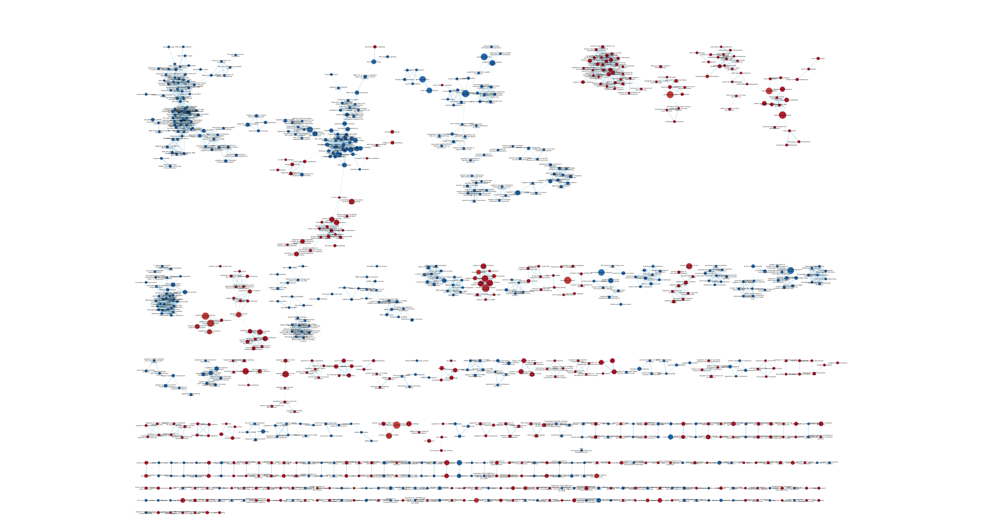

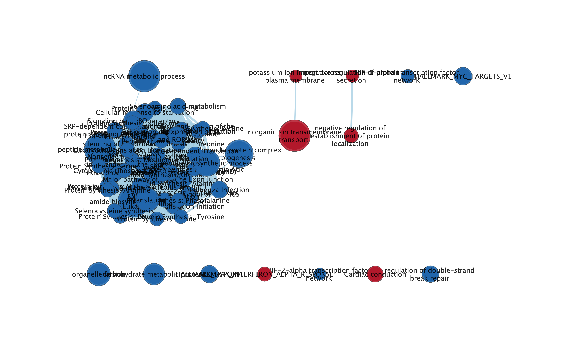

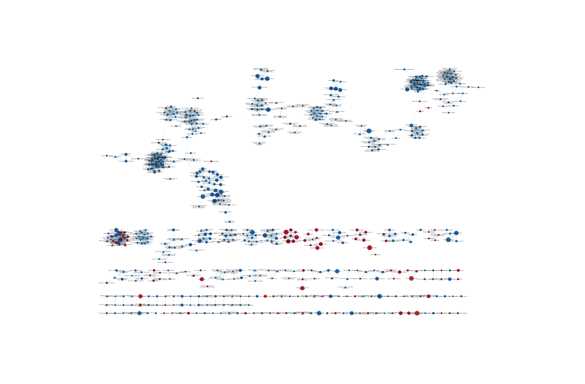

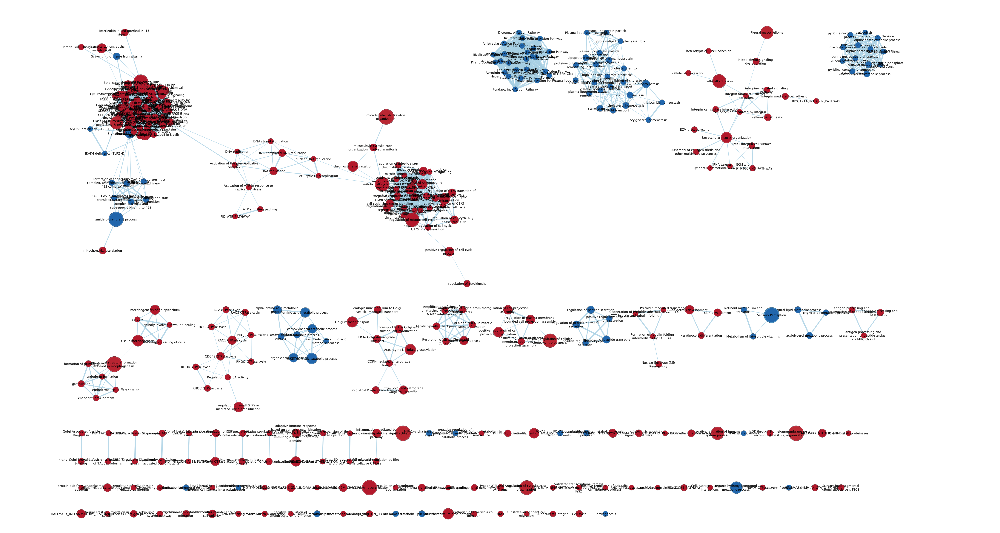

All analyses used a default parameter of Q-value = 0.1 and Edge Cutoff = 0.375.

We'll also display the number of nodes and edges for each

```{r}
network_table <- data.frame(
  condition = c("60 VS 0", "60 VS 40", "40 VS 20", "20 VS 15"),
  nodes = c(974, 76, 632, 1241),
  edges = c(2658, 1796, 3263, 12571)
)

# Use kable to display the table
kable(network_table, caption = "Table x: Network Analysis Results", align = 'c')
```

## Annotating our Enrichment Maps

We next used AutoAnnotate to annotate our data.

The clusterMaker App was used.

The Cluster algorithm was *MCL Cluster*

The Edge weight column used the *similarity-coefficient*.

Singleton clusters were created.

The networks were laid out such that they would try to prevent cluster overlap.

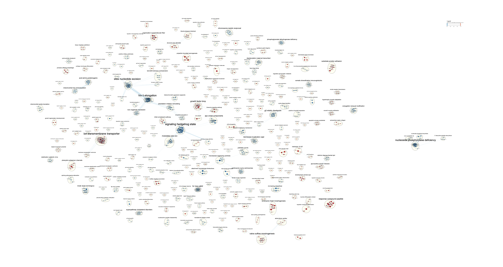

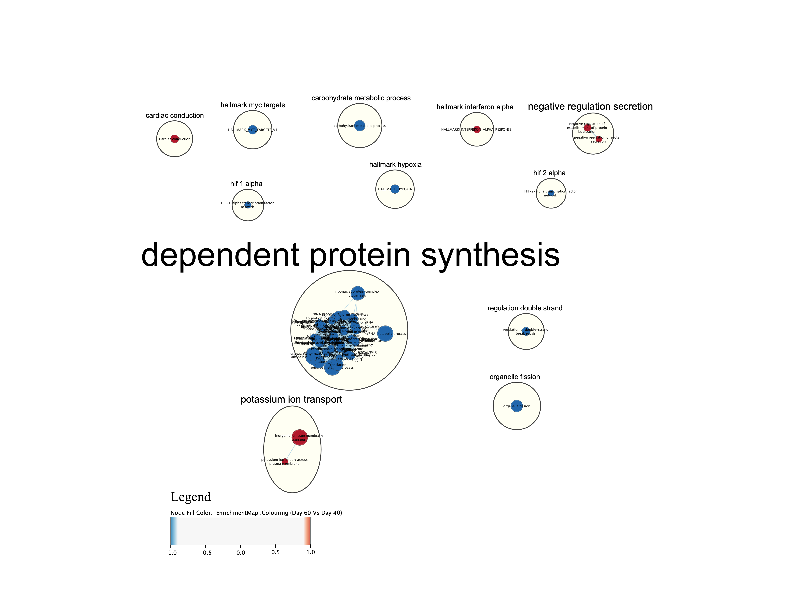

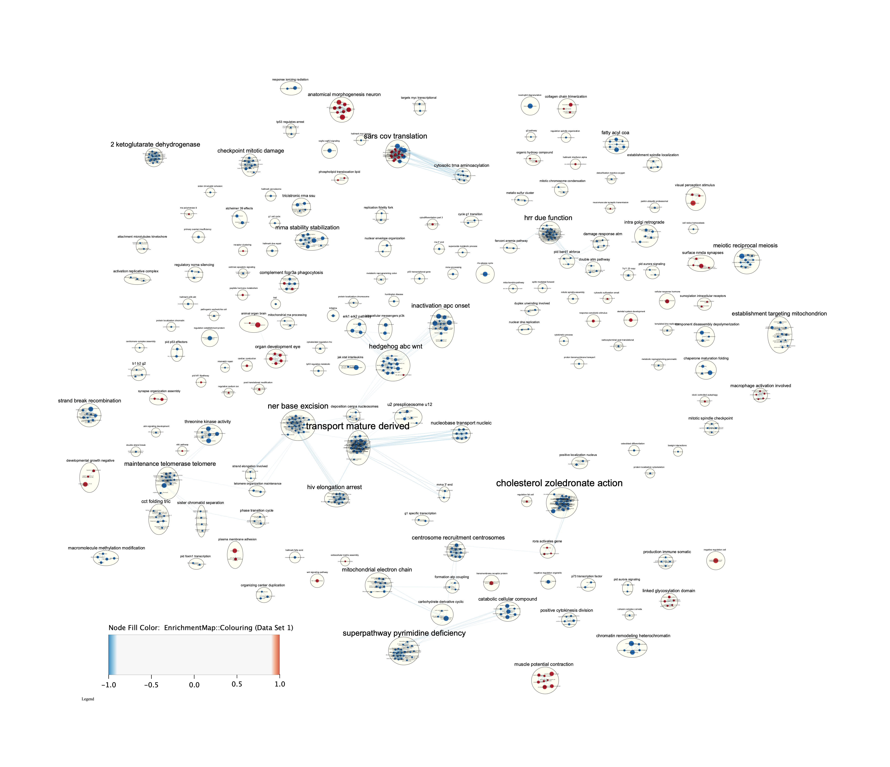


## Publication Ready Figures

To do this, the Publication-Ready box was checked off in the EnrichmentMap panel. Legends were added as well.

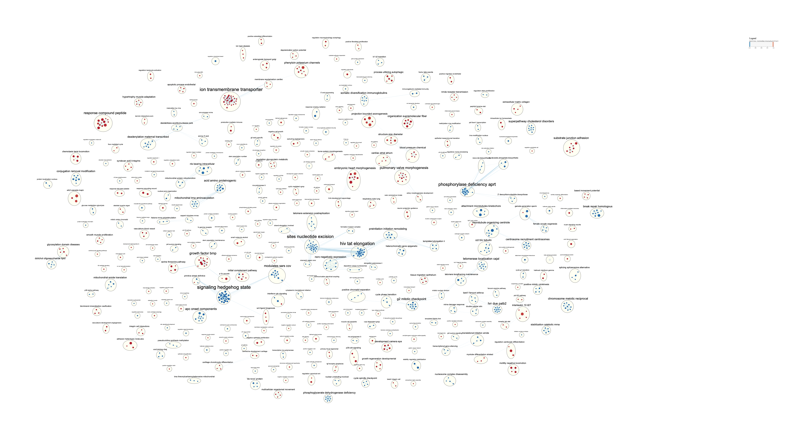

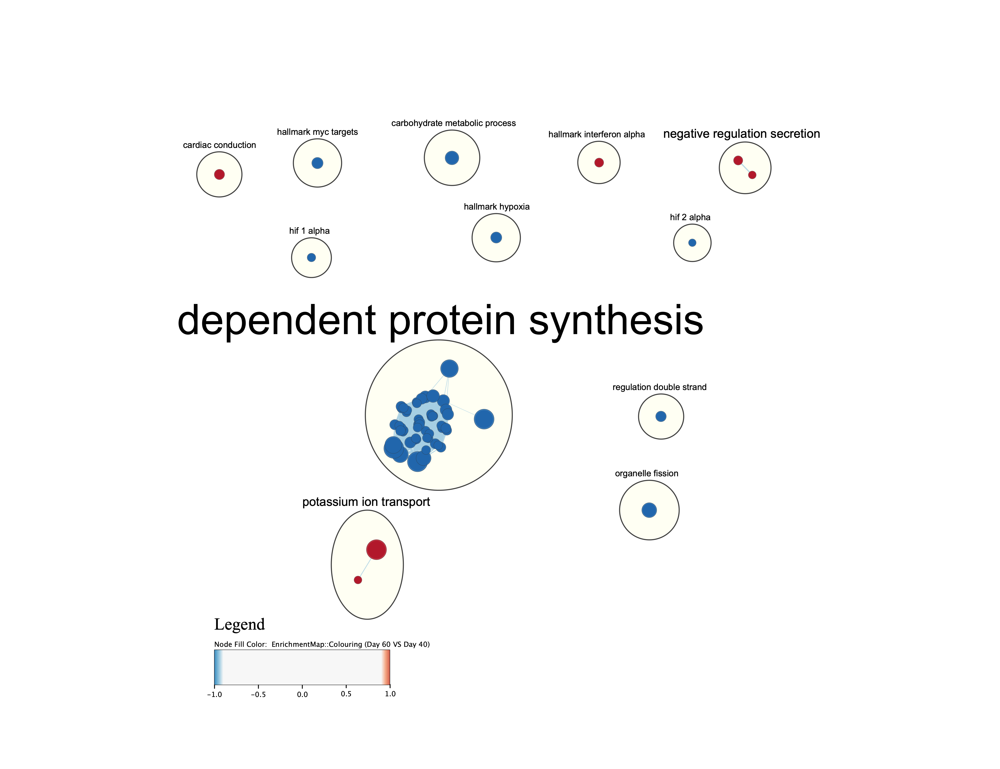

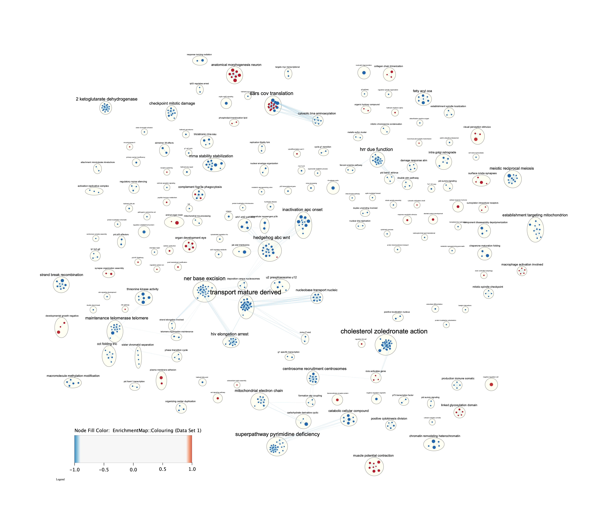


## Collapsing the Networks into Theme Networks

To do this, the annotations were all selected for, right-clicked on, and the option to create summary networks came up. They were then adjusted to look better.

![Figure 4A: Day 60 to Day 0 comparison. This is a very large network due to it comparing differences at the beginning and the end of the analysis. We see a few connected clusters. In the top left, we see a cluster involving membrane polarization, presumably related to the membrane polarization that CMs need. In the middle-top, we see clusters regarding morphogeneses upregulated, which make sense, since these are iPSCs differentiating into CMs. Below that is a cluster regarding DNA synthesis being down-regulated, which fits in with the previous analyses.](./cytoscape_q4/Day 60 VS Day 0.png)

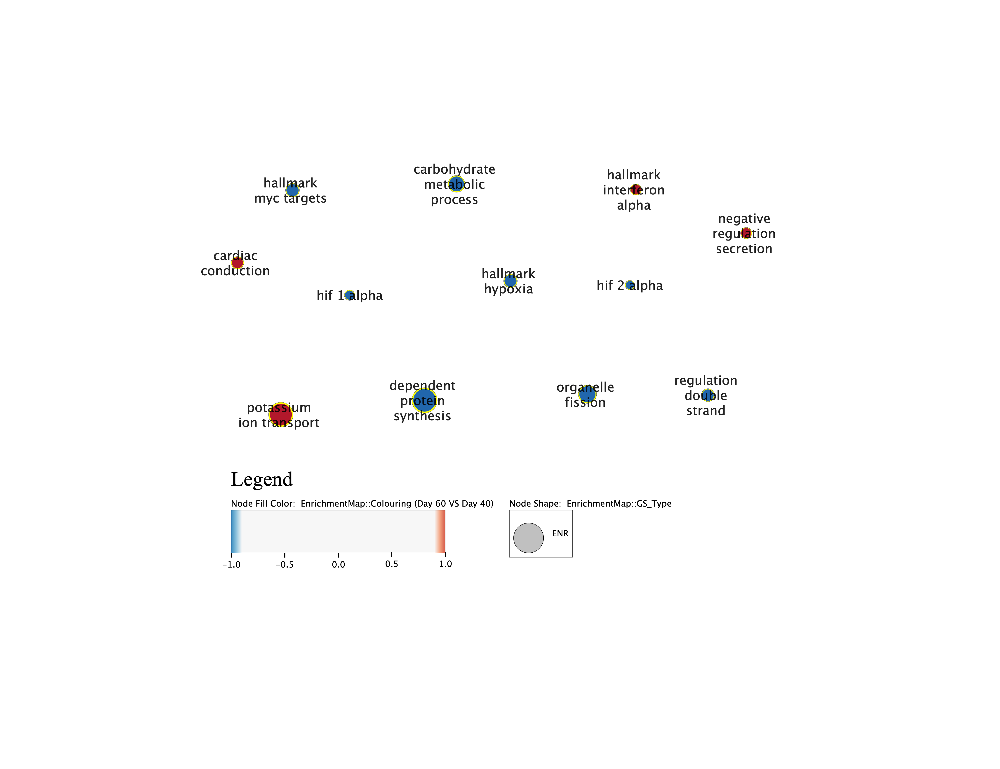


All these results discussed in the figure headings agree with the previous two analyses done, as discussed in all of the figure headings.

I will say, seeing that telomerase activity was downregulated according to the GSEA + Cytoscape analysis for the day 40-20 comparison was extremely insightful, because it would make perfect sense that telomerase activity would go down as cells go from an immortal, stem-state, to a differentiated cell type.

# Interpretation

### Do the enrichment results support conclusions or mechanism discussed in the original paper?

As a note, some of the interpretation is taken, used, and modified from A2.

We once again face the same issue as A2 in determining this, because the authors were using other datasets to compare differentiation protocols to see whether or not using a Wnt inhibitor while directing differentiation into cardiomyocytes would cause their hPSCs to be more akin to adult LV cardiomyocytes.
Our data and analysis is restricted to just this dataset, so all we can comment on is what we found.
With this in mind, we can begin to answer this question.
In our pairwise day comparisons we indeed see many of the same terms being upregulated in Figure 2C of the article. This indicates that, for upregulation at the very least, we have similar results.
These include terms like muscle tissue development, actin-mediated cell contraction, and more.
Additionally, we also get some similar terms for down-regulation, including ncRNA metabolic process and ribosome biogenesis. What we don't see at all, however, are the down-regulation results, which we've found to be potentially interesting, including things like down-regulation of amino acid synthesis pathways and telomerase pathways. The telomerase pathway finding likely supports the conclusions made by the article.
Together, we see that our analysis concurs with the research group's, such that the protocol indeed up-regulated pathways related to creating cardiomyocytes and downregulated 'general' and 'stem-my' pathways as it differentiated.

Additionally, I would also say that the results of GSEA and GSEA + Cytoscape align well with those found in assignment 2. This likely indicates that our findings regarding the data were valid, and since we also line up with the original paper well, there's reason to believe that we completed a robust total analysis. Additionally, it also indicates that the data used was robust, and that all pathway databases used were complete.

### Can you find evidence, i.e. publications, to support some of the results that you see? How does this evidence support your results?

We will reiterate our comparison from A2 since it agrees with A3:

The article's main goal was to show that a methodology could be derived to improve the differentiation of hPSCs into cardiomyocytes more effectively, and their choice was to using CHIR to inhibit Wnt.
When the authors compared their dataset to Cyganek et al.'s, they actually found that the other group's day 90 compared favourably to our group's day 60, indicating that our group's differentiation protocol was good at making mature cardiomyocytes more quickly.
Now, for our analysis, it would have been nice for us to have been able to compare our analysis to the other group's day 90 to see if we had similar ORA results, and to see if we ran a GSEA result on their data, to see if it could match our GSEA results.
Additionally, in a study looking at NOTCH1 knockouts by Ye et al., they also conducted a overrepresentation analysis, and in their day 10 cardiomyocytes, they had a similar result where pathways upregulating heart muscle development were favoured, and pathways involved in the cell cycle were downregulated.
Together, this increases the confidence that our results show a robust differentiation protocol of hPSCs in cardiomyocytes.

For our new additions, I'd like to focus on telomerase activity. In a study by Armstrong et al [@Armstrong2005-zj], the group also found that telomerase activity decreased as differentiation proceeded. As a result, I am far more confident regarding this finding.

While Killberg et al.[@Kilberg2016-zk] published this as a review article, they discuss the important of amino acids as a form of metabolism. If this is the case, it stands to be true that perhaps the cells were downregulating amino acid synthesis due to an over-abundance, and potentially a switch to amino acid metabolism so that they could effectively use the excess amount of amino acids in vivo. Further analysis in amino acid metabolism pathways would likely be fruitful here.

# Post-Analysis using Transcription Factors

I chose to look at specific transcription factors that may be related to our networks here. I focussed on a range of them, including ADA2 and FOXE1 since my former PI would mention them so frequently in regards to this project.

For ADA2, it serves as a growth factor, and since it's a deaminase[@Lee2020-ce], it could be involved in the aforementioned drop for protein synthesis.

For FOXE1, a previous study found that it was involved in thyroid morphogenesis as it controls differentiation[@Zannini1997-tf], but it caught my attention as a top hit in our analysis, so I'm including it.

Since my initial project was interested in finding transcription factors that could be used at every stage of differentiation, I decided to limit it to pairwise comparison (i.e., not the 60 vs 0).

To do the following analyses, I used a two-sided Mann-Whitney. I took the top 5-15 results from each because it got extremely messy otherwise.

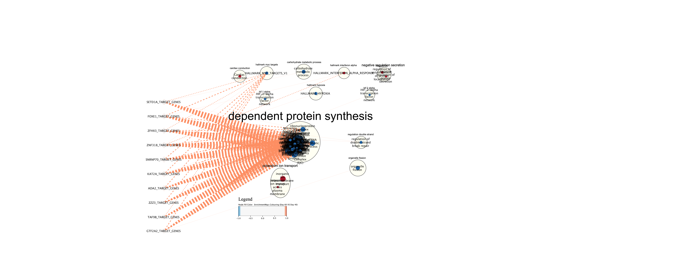

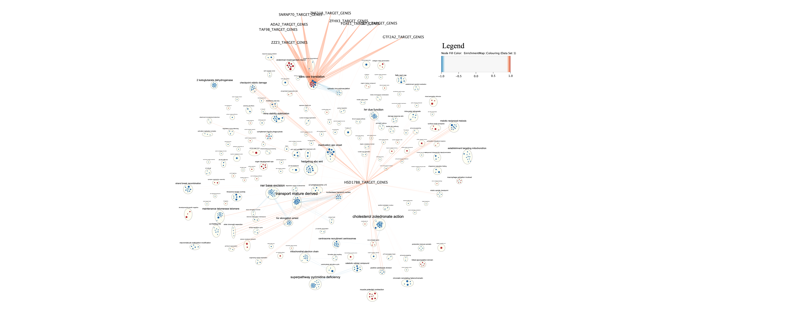

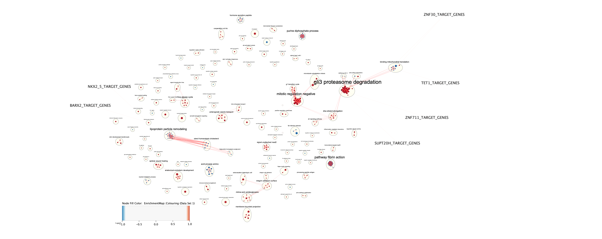

Day 20 to Day 15 comparison. The aforementioned TFs don't appear here, but SUPT20H[@Gomes2002-ab], a TF involved in antigen-positive hematopoietic stem cells present atgli3 proteasome degradation.

I admittedly did not get as much as I wanted to out of this analysis. What we can immediately see is that ADA2 and FOXE1 are both TFs involved protein synthesis and downregulation. This however does show that there are many transcription factors that are significant and contribute to the modulation of protein synthesis, which could prove to be integral to iPSC to CM differentiation.

# Links to Questions

- A1 + A2 Recap [Assignment 1+2 Recap]
- GSEA Q1 [Non-Thresholded GSEA]
- GSEA Q2 [Results from GSEA]
- GSEA Q3 [Summary of GSEA results and Comparison to g:Profiler Results]
- Cytoscape Q1 [Creating Enrichment Maps]
- Cytoscape Q2 [Annotating our Enrichment Maps]
- Cytoscape Q3 [Publication Ready Figures]
- Cytoscape Q4 [Collapsing the Networks into Theme Networks]
- Interpretation Q1 [Do the enrichment results support conclusions or mechanism discussed in the original paper?]
- Interpretation Q2 [Can you find evidence, i.e. publications, to support some of the results that you see? How does this evidence support your results?]
- Post-Analysis [Post-Analysis using Transcription Factors]

# References